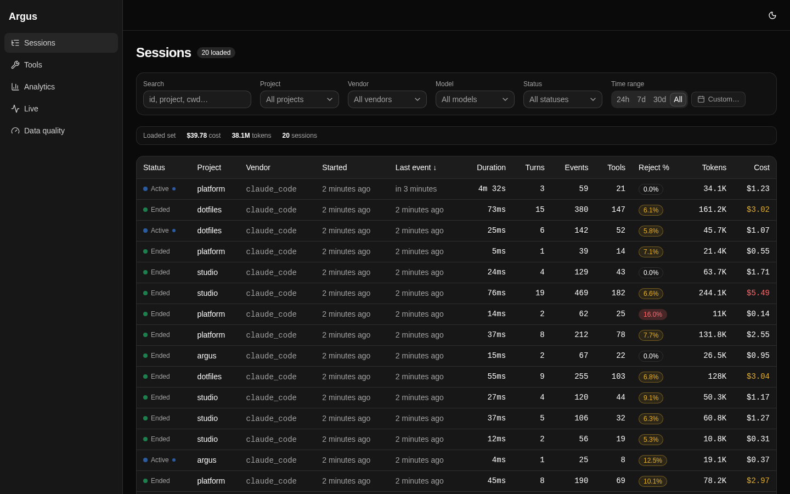
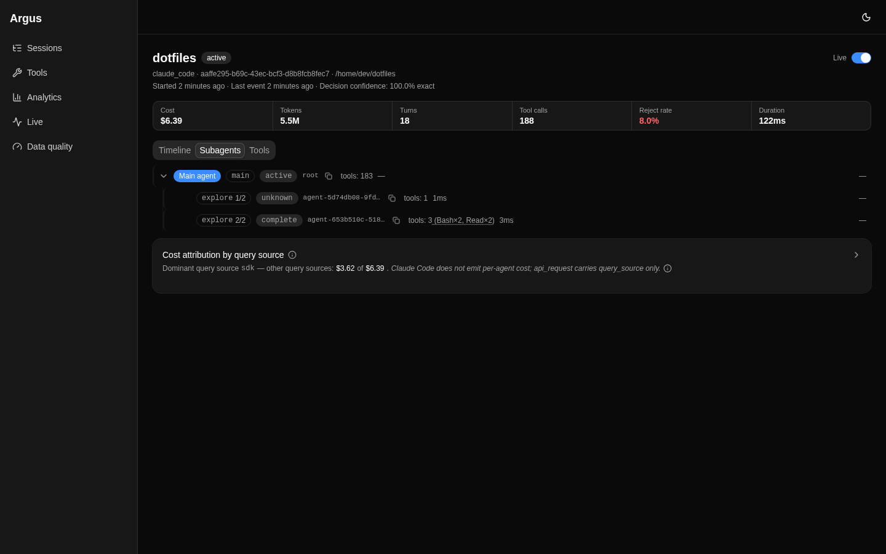
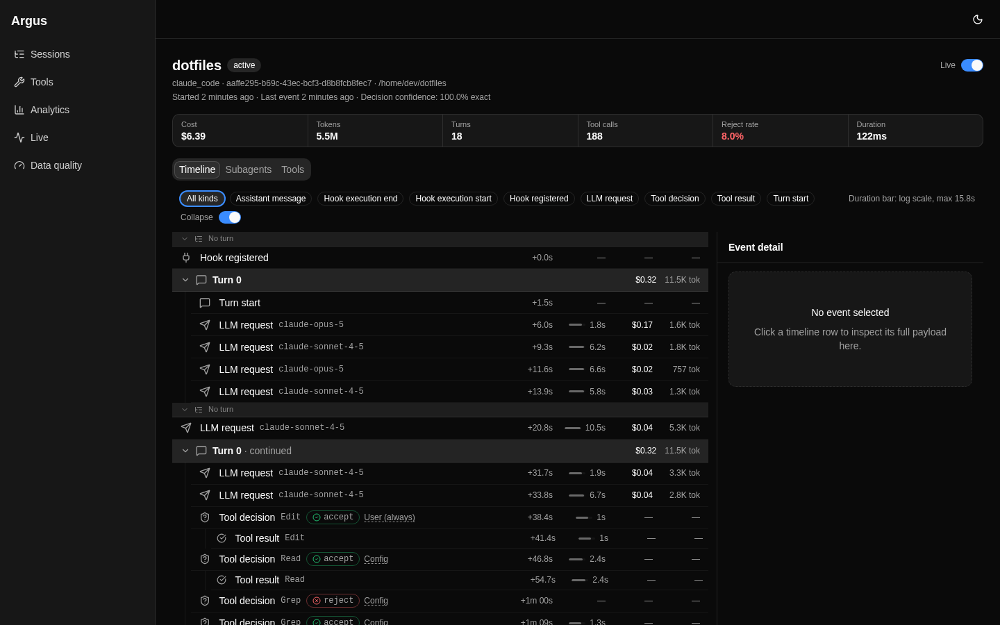
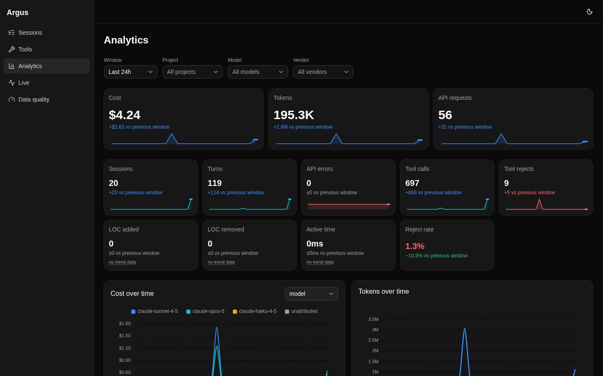
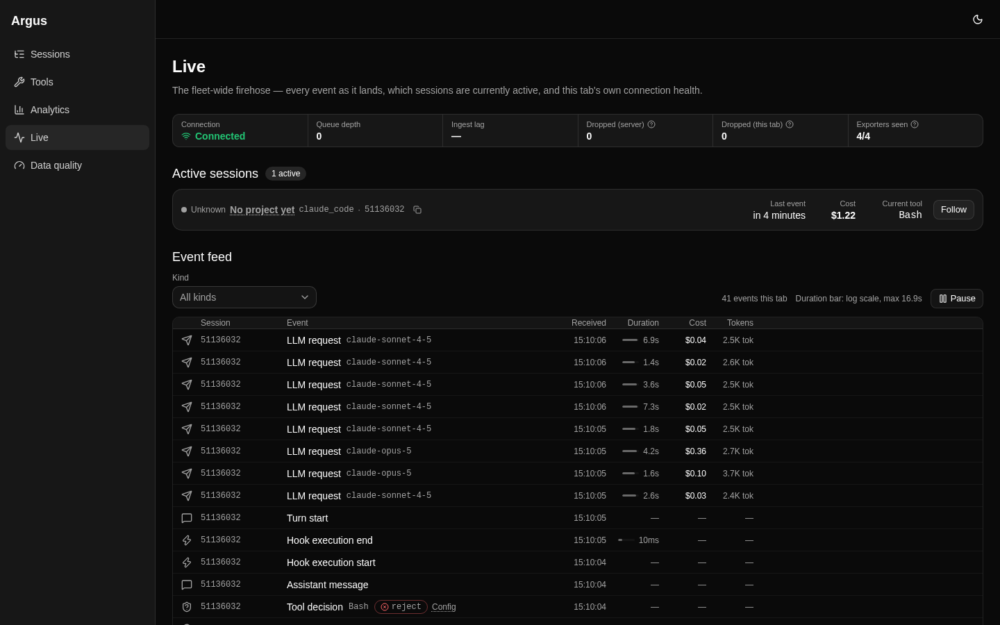
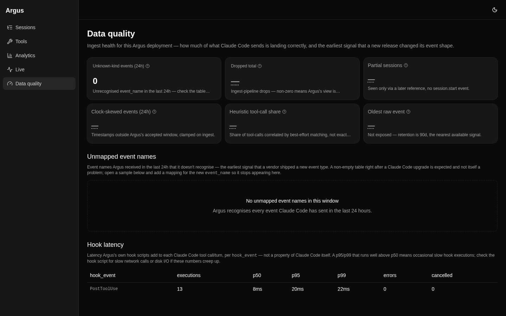
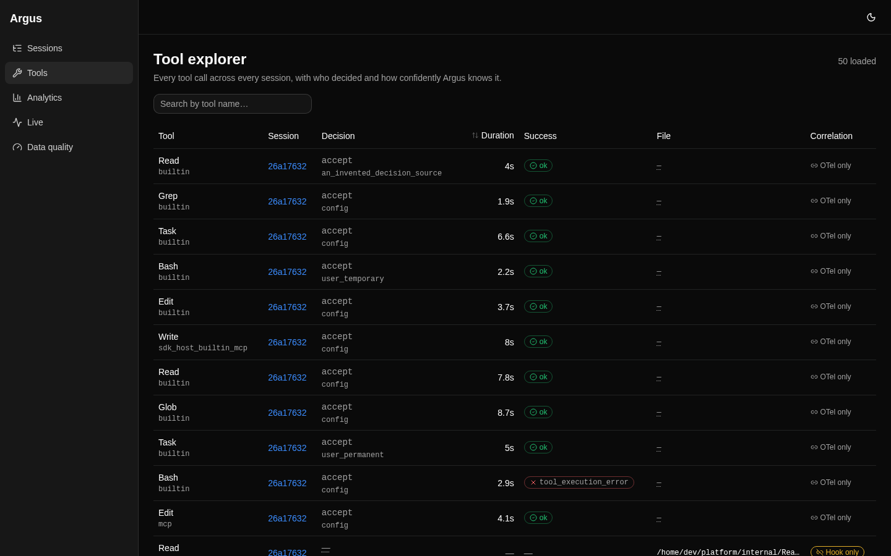

# Argus

**Argus is a self-hosted observability platform for Claude Code (and any OTel-emitting coding
agent).** Where the usual dashboards stop at tokens and cost, Argus models the two things nobody
else does: **permission/tool-decision provenance** — every accept/reject *and who decided it*
(`config`, `hook`, or `user`) — and **subagent trees** as first-class objects, on a normalized,
agent-agnostic event schema. It ingests OTLP logs/metrics and Claude Code hook events, stores them
in Postgres, and serves a session explorer, cost/token analytics, a live view, and a data-quality
surface.

> **Status: v0.1.0 — pre-alpha.** Dogfoodable and useful, but APIs, schemas, CLI flags, and the
> data model may change without notice before 1.0. Self-hosted only; no auth, no multi-tenancy in
> v1. Argus is an independent open-source project and is **not affiliated with or endorsed by
> Anthropic**.



## Why Argus

Grafana-style dashboards and `ccusage`-class tools answer "how many tokens, how much money".
Argus answers questions about *what the agent actually did*:

- **Decision provenance.** Every tool call carries its outcome and its decider. A reject auto-applied
  by your `settings.json`, a reject from a hook, and a reject you clicked are three different facts —
  Argus keeps them distinct, in the timeline and in the analytics.
- **Subagent trees.** A session's subagents are modeled as a real tree (parent agent → children),
  each with its own tool counts and status, not flattened into one stream.
- **Agent-agnostic core.** Ingestion is OTLP-native, so any OTel-emitting agent works; Claude Code
  is supported first and deepest. No vendor attribute vocabulary is ever constrained — a value the
  agent invents next release still lands, surfaced under an `unknown` kind rather than dropped.



## Quickstart

A stranger should get from a clone to live data in about two minutes. Verified end-to-end from a
clean checkout. Prefer one guided command over the steps below? See
[Install & customize](#install--customize).

### 1. Start the stack

```bash
git clone https://github.com/YohannHommet/argus.git
cd argus
docker compose -f deploy/docker-compose.yml up -d
```

On first run this builds `argusd` from source (it compiles and embeds the Vue UI) and starts it
alongside Postgres. Once v0.1.0 is published to GHCR, `docker compose pull` fetches the prebuilt
image instead. If host port 8080 is taken, rebind it:

```bash
ARGUS_HTTP_PORT=18080 docker compose -f deploy/docker-compose.yml up -d
```

The UI is then at <http://localhost:8080> (or your `ARGUS_HTTP_PORT`).

Prefer a shortcut? `make up` does the same (build, start, wait for ready, print the URL); then
`make demo` for sample data, `make logs`, `make status`, `make down`. Override the port with
`make up PORT=18080`. Run `make help` for the full list.

### 2. Point Claude Code at Argus

```bash
make install-hook
```

This writes both the OTel env block and the hook block into `~/.claude/settings.json` for you —
it's the one re-runnable command that keeps Claude Code's wiring in sync with whatever port Argus
is on (see [Changing the port](#changing-the-port)) — no hand-editing, and it works whatever your
shell is (zsh, bash, fish), because the config lives in `settings.json`, which Claude Code reads
itself. Under the hood it merges in:

```json
{
  "env": {
    "CLAUDE_CODE_ENABLE_TELEMETRY": "1",
    "OTEL_LOGS_EXPORTER": "otlp",
    "OTEL_METRICS_EXPORTER": "otlp",
    "OTEL_EXPORTER_OTLP_PROTOCOL": "http/protobuf",
    "OTEL_EXPORTER_OTLP_ENDPOINT": "http://localhost:8080",
    "OTEL_EXPORTER_OTLP_METRICS_TEMPORALITY_PREFERENCE": "delta",
    "OTEL_LOG_TOOL_DETAILS": "1"
  },
  "hooks": {
    "PostToolUse":  [ { "hooks": [ { "type": "http", "url": "http://localhost:8080/ingest/hook", "timeout": 5 } ] } ],
    "SessionStart": [ { "hooks": [ { "type": "http", "url": "http://localhost:8080/ingest/hook", "timeout": 2 } ] } ],
    // SessionEnd hooks share a hard 1.5 s budget — keep this at 1.
    "SessionEnd":   [ { "hooks": [ { "type": "http", "url": "http://localhost:8080/ingest/hook", "timeout": 1 } ] } ]
  }
}
```

`OTEL_LOG_TOOL_DETAILS=1` is what populates tool file paths, the `subagent_type` linkage, and the
file-touch view — without it those fields stay empty. It also makes Claude Code log full tool
parameters (including Bash command text) to your collector, so it is your call; Argus works without
it, you just lose those three views. The hooks cover the events OTel doesn't emit (session
lifecycle, tool decisions); `SessionEnd`'s 1 second timeout is on purpose — every `SessionEnd` hook
shares one hard 1.5 s budget, and Argus acks in milliseconds, so a larger value only eats into other
hooks' share.

`make install-hook` merges — every other key and hook already in your `settings.json` is preserved,
and a `.bak` is written before it edits the file. `make uninstall-hook` removes exactly what it
added. Both apply to every Claude Code session, including `claude agents`.

Prefer to wire it by hand? These are the same OTel values `make install-hook` writes — paste them
into your shell before launching `claude` (the `export` syntax works in bash and zsh):

```bash
export CLAUDE_CODE_ENABLE_TELEMETRY=1 \
       OTEL_LOGS_EXPORTER=otlp OTEL_METRICS_EXPORTER=otlp \
       OTEL_EXPORTER_OTLP_PROTOCOL=http/protobuf \
       OTEL_EXPORTER_OTLP_ENDPOINT=http://localhost:8080 \
       OTEL_EXPORTER_OTLP_METRICS_TEMPORALITY_PREFERENCE=delta \
       OTEL_LOG_TOOL_DETAILS=1
```

Swap `http://localhost:8080` for your `ARGUS_HTTP_PORT`. `make install-hook` is still preferred —
it also wires the hooks and stays in sync when the port changes.

### 3. Open the UI and use Claude Code

Run a Claude Code session and open <http://localhost:8080>. Sessions, turns, tool decisions, and
cost appear within one turn.

### No real traffic yet? Generate demo data

```bash
docker compose -f deploy/docker-compose.yml exec argusd \
  /argusd sim --mode=demo --seed=42
```

`--mode=demo` seeds a deterministic set of ~20 sessions with subagents, decisions, and cost so you
can explore every view immediately. (`--mode=load` is the load generator — see
[`docs/OPERATIONS.md`](docs/OPERATIONS.md).)

## The six views

| View | What it shows |
|---|---|
| **Sessions** | Session list with cost, tokens, tool counts, reject rate; filter by project, model, vendor, date, status. |
| **Session detail** | Turn-by-turn timeline with decision badges, plus the subagent tree and per-source cost attribution. |
| **Tools** | Tool-usage explorer: which tools, how often, accept/reject breakdown. |
| **Analytics** | Cost/token/decision dashboards over a window, split by model and project. |
| **Live** | The fleet-wide firehose — every event as it lands, active sessions, and ingest health, in real time (SSE). |
| **Data quality** | Ingest health: dropped events, unrecognised event names, clock skew, hook latency. |

| | |
|:--:|:--:|
|  |  |
| **Session timeline — decision provenance** | **Cost & token analytics** |
|  |  |
| **Live view (SSE)** | **Data-quality surface** |
|  | |
| **Tools explorer** | |

## Performance

The async, batched ingest path sustains the **1000 events/s** target with **zero dropped events**
(and no `too_old` rejections or deadlock-retries) at ~20 ms median write latency. See the
[load-test results](docs/OPERATIONS.md#load-test-results) for the full rate → latency/drops table, and
`scripts/loadtest.sh` to reproduce.

## Install & customize

The fastest path from a clone to a running, wired-up Argus:

```bash
git clone https://github.com/YohannHommet/argus.git
cd argus
make setup
```

`make setup` checks for Docker, creates `deploy/.env` from `deploy/.env.example` (skipped if it
already exists), builds and starts the stack, and runs `make install-hook` for the port you're on —
merging Argus's hooks (`PostToolUse`, `SessionEnd`, `SessionStart`) and its OTel env block into
`~/.claude/settings.json`. `make install-hook` / `make uninstall-hook` do just that step on their
own, at any time — both are idempotent and touch only Argus's own hook and env entries: every other
hook and env key already in your `settings.json` is preserved, and a `.bak` is written before
either one edits the file.

To customize a knob — the port, retention, rollup cadence, ingest/API auth tokens, log level —
edit `deploy/.env` (gitignored, never committed) and run `make up` again; no need to hand-edit
`deploy/docker-compose.yml` or `settings.json`. `deploy/.env.example` documents each knob with its
default; the full generated `ARGUS_*` reference is
[`docs/config-reference.md`](docs/config-reference.md).

### Changing the port

The port is only ever set in one place, `deploy/.env`'s `ARGUS_HTTP_PORT` (or `PORT=` on the CLI),
but two things read it — the running stack and Claude Code's wiring — so a port change needs both
re-synced:

```bash
# edit deploy/.env's ARGUS_HTTP_PORT, or just pass PORT= below
make up PORT=18080
make install-hook PORT=18080
```

`make up` moves the stack to the new port and, if `~/.claude/settings.json` still points Argus's
OTel endpoint at the old one, prints a one-line reminder (it never edits the file itself).
`make install-hook` is what actually does the re-sync: re-running it replaces every Argus hook URL
and the OTel endpoint with the new port — no stale `:oldport` references, no duplicate entries.

## Configuration

Every setting is an `ARGUS_*` environment variable (or a YAML config file). The full, generated
reference — key, default, and meaning — lives in
[`docs/config-reference.md`](docs/config-reference.md), and the operational guidance (retention,
backup/restore, upgrades, troubleshooting) is in [`docs/OPERATIONS.md`](docs/OPERATIONS.md).

Run `argusd config --markdown` to print the reference for your build, or `argusd config` to dump the
effective configuration with secrets redacted.

## What Argus does *not* do (v1)

Deliberately out of scope for v1 — see [`docs/SPEC.md`](docs/SPEC.md) §9.1 for the full list and the
reasoning:

- **No per-subagent cost.** Claude Code does not emit cost per agent; `api_request` carries only a
  `query_source`, so Argus attributes cost by query source and says so, rather than inventing a
  per-subagent number.
- No alerting, no fleet view, no auth, no retention UI (there is an auth-shaped middleware seam for
  later).
- No OTel *traces* ingestion and no local JSONL transcript enrichment — both are v2, behind the same
  event model.

## Documentation

- [`docs/ARCHITECTURE.md`](docs/ARCHITECTURE.md) — the design: system diagram, package map, and the
  five invariants.
- [`docs/OPERATIONS.md`](docs/OPERATIONS.md) — running Argus: config, retention, backup, upgrade,
  troubleshooting.
- [`docs/SPEC.md`](docs/SPEC.md) — the full v1 specification.
- [`docs/DECISIONS.md`](docs/DECISIONS.md) — the binding design decisions.
- [`CHANGELOG.md`](CHANGELOG.md) — release history.
- [`CONTRIBUTING.md`](CONTRIBUTING.md) — how to build and contribute.

## Development

`argusd` is a single Go binary (stdlib `net/http` + chi, `pgx`/`sqlc`) with the Vue 3 + Vite UI
embedded; storage is Postgres. See `make help` for the developer targets (`dev`, `build`, `test`,
`lint`, `ci`, `gen`, `migrate`, `sim`, `compose-up`, `compose-smoke`).

## License

[MIT](LICENSE).
